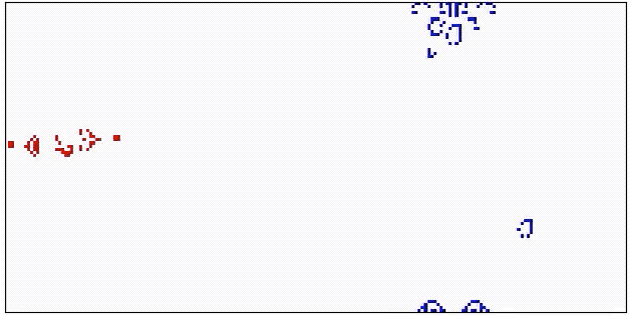
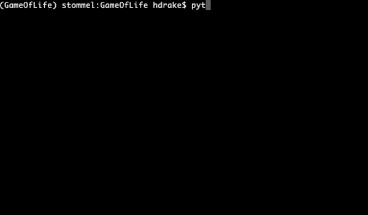

# Whizkey Game of Life tournament


See ``GameOfLife.py`` for rules!

### Setting up the Python environment
This code uses a few Python packages. To install them, first download and install [Miniconda](https://docs.conda.io/en/latest/miniconda.html) (or use your conda installation if you have one), and then either create a pre-packaged conda environment with
```shell
conda env create -f environment.yml
```
or create a new conda environment manually by running
```shell
conda create --name gameoflife python=3.7
```
If creating the environment manually, install the packages needed to run ``play_game.py`` and ``draw_input_matplotlib.py`` by running
```shell
conda install numpy scipy matplotlib
```

### Playing an adversarial match of Conway's Game of Life
To play a game, run
```shell
python play_game.py
```
By default, this game reads initial cell configurations from the ``Messi`` and ``Mothership`` files in the ``entries/`` folder (the two configurations pictured in the gif above) and then allows them to evolve for 1000 time steps. 

To play a game with other inputs files in the ``entries/`` folder, simply pass the two filenames as arguments to ``play_game.py``:
```shell
python play_game.py [File 1] [File 2]
```

### Entering the Whizkey tournament
All you have to do to enter the tournament is send one (or more!) input file(s) to Tristan and/or Santi by May 25. (Name the file whatever you want your team name to be.) The competition **will include two categories**: one where input files cannot have more than 100 active cells, and another where input files can have as many active cells as you want. We'll assume that you want to enter input files with <= 100 cells in the first category and files with >100 cells in the second category unless you tell us otherwise!

### Creating custom inputs files
You can create your own input files by running
```shell
python draw_input_matplotlib.py
```
and clicking on cells to toggle cells between being inactive (white) or active (black).



### Placing pre-defined patterns
In ```draw_input_matplotlib.py```, we have added the ability to load pre-existing Game of Life patterns in the conventional [Run Length Encoded (RLE) format](https://www.conwaylife.com/wiki/Run_Length_Encoded). We have place some common example patterns in ``patterns/``. To load in a pattern, simply run ``python draw_input_matplotlib.py`` and instead of clicking to toggle a single cell, press the `A` key (for "**A**dd pattern"). Type the name of the desired pattern (e.g. *glider*) in the terminal prompt and hit enter. When you return to the figure, clicking on a cell the pattern there. When you are done placing copies of the pattern, simply toggle the "Add pattern" mode off by pressing the `T` key (for "**T**oggle add pattern").

The following transformations can be by appending a pattern name with a period and a series of transformations, each separated by an underscore:
- `rx`: reflection in x
- `ry`: reflection in y
- `r90`: counter-clockwise rotation by 90°
- `r180`: counter-clockwise rotation by 180°

Other transformations, such as rotation by 270° degrees, can be accomplished by chaining the above transformations (e.g. `glider.r90_r180` will rotate a glider first 90° and then another 180° for a total of 270°.
